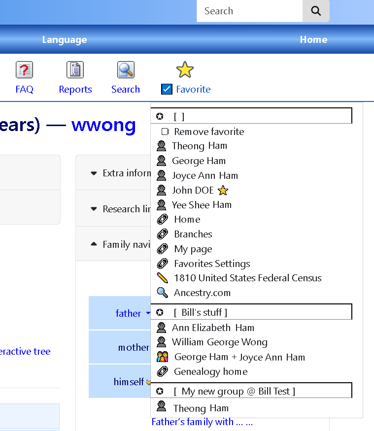

Favorites menu module for webtrees
==================================

Description
------------
This exposes the Webtrees Favorites list as a menu item. It is displayed on all non-admin pages. 
It provides a bookmark-like facility to make it easier to mark items and find them later. 
It works with most Webtrees pages including individuals, families and media. Other
pages can be marked as named links.

Operation
---------
The module adds a menu item on the far right. Depending upon the theme, the menu item
shows a star icon or some text. 

Clicking the menu item shows its menu which is a list of actions and favorites organized by group. 
There is one default group. Additional groups can be added to the menu.
Each user can create as many named groups as they would like. 
Groups can be shared and shared groups can be added to the menu. 

Favorites currently supported include individuals, families, media, sources, repositorie and URLs. 
The icon reflects whether the current page is marked as a favorite. 

The menu provides a way to add, move or remove a favorite from the default group. 
It is not possible to modify the other groups in the menu. 

Clicking on any group name will bring up the Favorites Settings page. 
This page allows groups to be renamed and to select the current group. 
It is also possible to move, delete and edit URL links. 
This is also a basic import/export facility using .CSV files. 

Installation & upgrading
------------------------
* Download and unpack the zip file and place the folder favorites-menu in the modules_v4 folder of webtrees.
* Upload the newly added folder to your server. It is activated by default.
* Go to the control panel, click in the module section on 'Menus' where you can find the newly added menu item.

Customization
-------------
Most of the icons and images used with the module are contained in the resources/css/styles.css. 
It is set up for most of the defaults themes but you may need to adjust or override 
things like background colors for your particular themes. 

Integration with Drupal
-----------------------
The [Drupal Webtrees module](https://www.drupal.org/project/webtrees) is another project that I have
which works with this one. The [Drupal](https://drupal.org) is an open source, content management system (CMS) 
that can be used in conjuction with Webtrees using the module. The module provides single sign-on (SSO)
support as well as a Favorites Menu block that works in conjunction with the favorites support of
this Webtrees module. 

The list of favorites in the menu this Webtrees module manages is avaialable in a Drupal block which
can be placed on pages within the Drupal website. Combined with the SSO support, it allows a user to 
move between the two systems with common links for faster navigation. 

Use of this Webtrees module DOES NOT require Drupal support or the use of the Drupal Webtrees module. 

Note
----
This is a simple module and provided as is. However, if you experience any bugs you can create a new issue on GitHub.

To Do
-----
* Figure out how to get the real page title when creating a URL link favorite. 
* Block that shows the current set of groups.

My projects
-----------
* [Webtrees Favorites Menu](https://github.com/bwong789/webtrees-favorites-menu) - this project
* [Drupal Webtrees module](https://www.drupal.org/project/webtrees) - provides single signon support for a mixed Drupal/Webtrees website. Supports Drupal Views to access Webtrees database. 

